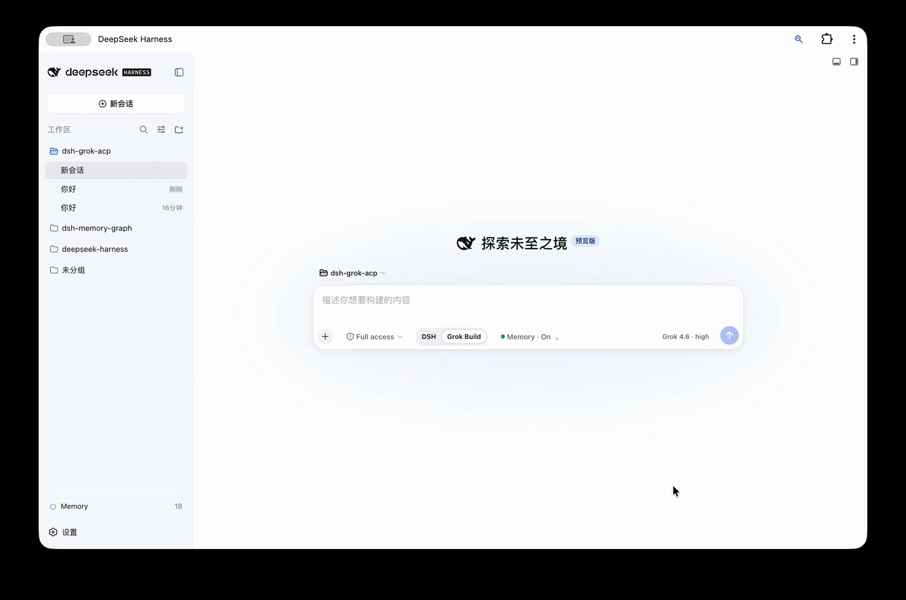
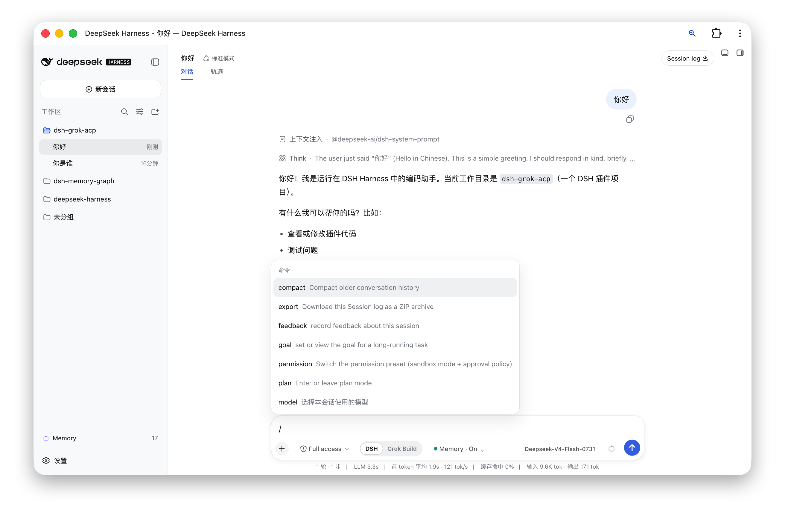
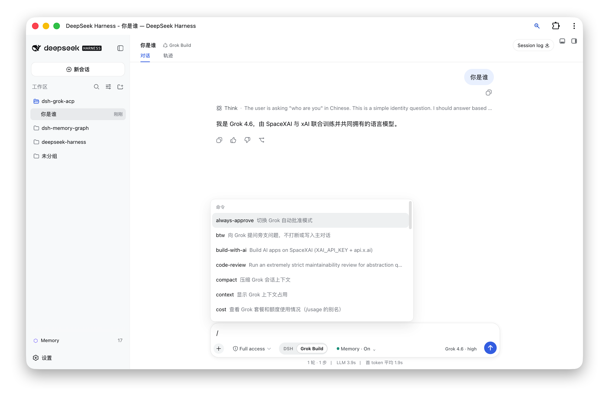

# DSH Agent Bridge

<div align="center">
  <strong>Run Grok Build inside DeepSeek Harness Web instead of opening a separate TUI</strong><br /><br />
  
  
  
  <a href="./LICENSE"></a>
</div>

<div align="center">
  🌏 <a href="./README.md">中文</a> · <b>English</b>
</div>

<div align="center">
  
</div>

`dsh-grok-acp` is an adapter in DSH Agent Bridge. It connects Grok Build as a root agent through Agent Client Protocol (ACP), while preserving the native DSH Web session, composer, tool rendering, permission, and Markdown diff interfaces.

> Grok Build is the only adapter today. The broader **DSH Agent Bridge** project name leaves room for future Codex and Claude Code adapters without tying the repository to one vendor or protocol.

## Features

- Select **DSH** or **Grok Build** in the same `dsh web` composer.
- DSH mode retains the Standard, PTC, Minimal, and Creator presets, installed models, and plugins.
- Grok Build mode uses Grok's own models and hides unrelated DSH agent presets.
- ACP streaming output becomes native DSH answers, thoughts, tool calls, plans, and diffs.
- Grok permission requests use the DSH approval interface.
- Supports `/usage`, `/context`, `/session-info`, `/btw`, `/model`, and `/effort`, including the `/uasge` compatibility spelling.
- The harness can change while a session is blank and locks after the first message to prevent mixed-engine history.
- Grok sessions share one lazily started ACP process, which closes after the configured idle period.
- Installs as an independent DSH Bundle and does not modify the global DSH package or DeepSeek Harness source.

| DSH | Grok Build |
|---|---|
|  |  |

## Architecture

```text
DSH Web composer
       │
       ├── DSH ───────────► official AgentLoop, models, tools, and plugins
       │
       └── Grok Build ────► dsh-grok-acp ── ACP/stdio ──► grok agent
                                  │
                                  └── DSH session log / tool UI / approval UI
```

The plugin changes the agent preset while a session is blank and routes agent creation to either the official DSH AgentLoop or the Grok ACP agent. Model-visible output is still recorded in the DSH session log, so replay, titles, tool results, and diffs continue to use native DSH Web rendering.

## Installation

### Requirements

- macOS or another environment supported by the Grok Build CLI.
- Node.js `^22.19` or `>=24`.
- DeepSeek Harness `0.1.1-rc.2` installed globally, with a working `dsh web` command.
- Grok Build CLI installed and authenticated; `grok --version` must succeed.

### Option 1: Install from npm (recommended)

Run:

```sh
dsh plugin --profile web add dsh-grok-acp@latest
dsh web
```

Open [http://127.0.0.1:3080](http://127.0.0.1:3080) and create a new session. Use `Cmd/Ctrl + Shift + R` if the browser still has an older client bundle cached.

### Option 2: Install from a cloned project directory

Use this method when you want the latest GitHub source. Clone and build the project first, then give its directory directly to DSH:

```sh
git clone https://github.com/zmh2000829/DSH-agent-bridge.git
cd DSH-agent-bridge
npm install --legacy-peer-deps
npm run check
dsh plugin --profile web add "$(pwd)"
dsh web
```

`$(pwd)` means the full path of the current cloned project. If the project already exists locally, you can provide its absolute path directly:

```sh
dsh plugin --profile web add /Users/your-name/Projects/DSH-agent-bridge
```

Choose either installation method; do not run both. The Grok preset loads directly from the package and does not copy or overwrite `~/.dsh/harness-presets`.

### Verify the installation

```sh
dsh plugin --profile web exec dsh-grok doctor
```

The report should show that DSH, Grok, the Bundle, the preset, and the client build are ready.

## Usage

1. Start `dsh web` and open port 3080.
2. Select “New session.”
3. Choose **DSH** or **Grok Build** below the composer.
4. DSH mode exposes four agent presets above the composer. Grok Build mode exposes the Grok model and reasoning-effort control inside the composer.
5. The harness locks after the first message. Create a new session to use another harness.

| Command | Purpose |
|---|---|
| `/usage`, `/cost`, `/uasge` | Show plan and usage information |
| `/context` | Show context usage |
| `/session-info` | Show Grok session information |
| `/btw <question>` | Ask a side question without interrupting the main task |
| `/model <model>` | Change the Grok model |
| `/effort <level>` | Change reasoning effort |
| `/compact`, `/goal`, `/workflow`, `/deep-research` | Forward the corresponding capability to Grok Build |

## Configuration

The default command is `grok agent --no-leader stdio`.

| Variable | Purpose |
|---|---|
| `GROK_COMMAND` | Grok executable; defaults to `~/.grok/bin/grok`, then `grok` from `PATH` |
| `DSH_HOME` | DSH home, defaulting to `~/.dsh` |
| `XAI_API_KEY` | Optional value forwarded to the Grok process |

Advanced deployments can override `command`, `args`, `env`, `stateFile`, `disposeGraceMs`, `idleDisposeMs`, and `yoloMode` in the Web profile's `cordis.patch.yml` entry.

## ACP coverage

- Initialization and authentication: `initialize`, `authenticate`.
- Sessions: `session/new`, `session/resume`, `session/load`, `session/close`.
- Execution: `session/prompt`, `session/cancel`, `session/set_config_option`.
- Stream events: assistant, thought, tool call, tool result, plan, commands, model.
- Client capabilities: permission requests, `fs/read_text_file`, `fs/write_text_file`.
- Grok extensions: billing, BTW, session info, models.

## Updating and uninstalling

Update an npm installation with `dsh plugin --profile web add dsh-grok-acp@latest`. For a source installation, run `git pull`, `npm install --legacy-peer-deps`, `npm run check`, and `dsh plugin --profile web add "$(pwd)"` from the cloned project directory.

Uninstall through the profile command, then restart DSH:

```sh
dsh plugin --profile web remove dsh-grok-acp
dsh web
```

Do not edit `~/.dsh/profiles/web/package.json` by hand. Removing the plugin does not remove Grok authentication or Grok session files.

## Development and publishing

```sh
npm install --legacy-peer-deps
npm test
npm run build
npm pack --dry-run
```

- `lib/*.js` contains the Node plugin and publication entry points.
- `src/client/index.tsx` is the Web client source; `npm run build` emits `lib/client.js`.
- `presets/grok-build` contains the packaged agent preset.
- `.github/workflows/ci.yml` tests, builds, and checks npm package contents on Node 24.

The project homepage, issue tracker, and source are available at [zmh2000829/DSH-agent-bridge](https://github.com/zmh2000829/DSH-agent-bridge).

## Security and limitations

- The browser bridge accepts only loopback hosts and rejects cross-site requests. Writes require same-origin JSON requests.
- ACP file requests resolve relative paths against the session workspace. Use the plugin only with trusted repositories and disable `yoloMode` when automatic approval is not appropriate.
- The plugin currently targets DSH `0.1.1-rc.2`. DSH prereleases may change internal AgentFactory or client Slot APIs; rerun tests and a real blank-session flow after upgrading DSH.
- Terminal-layout features from the Grok Build TUI cannot be embedded unchanged. This project reuses agent capabilities and commands and renders them through DSH Web.
- Codex and Claude Code adapters are not implemented yet. They should be separate adapters rather than conditional branches inside the Grok implementation.

## Roadmap

- Extract a stable `ExternalAgentAdapter` interface.
- Add a Codex adapter.
- Add a Claude Code adapter.
- Add adapter capability discovery, settings UI, and a compatibility matrix.

Issues and pull requests are welcome. Licensed under the [MIT License](./LICENSE).
